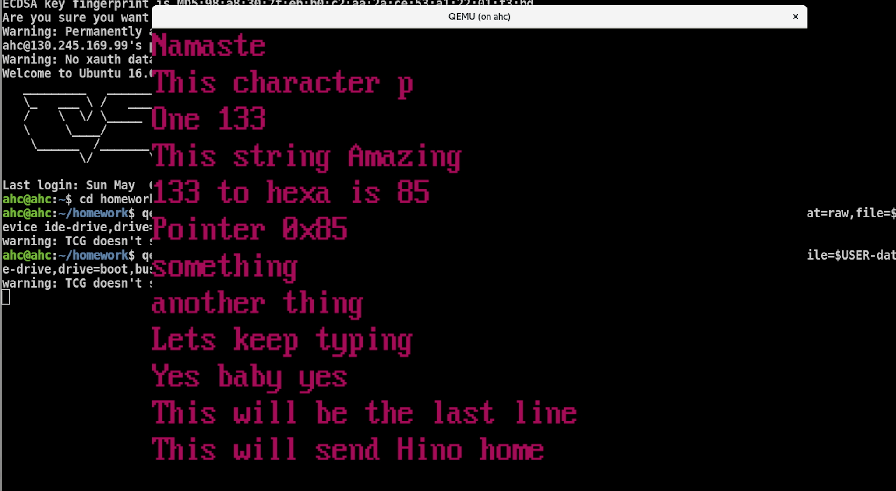

## Graphical console

### GOAL 

Print to each pixel on the screen via video memory given the below setup and to implement a font to test.

The code exposes the following API :

    hwfont(const char *fmt, ...) - Similar to "kprintf()" or "printf()" that prints to the graphical console using the font included.
    
    PrintToPixel(int x, int y, int color) - Populates pixel at (x, y) with color "color".
    
    PrintACharacter(char ch, int x, int y, int color) - Prints a character "ch" with color "color" and the top-left part of the character at (x, y).

### Setup

https://compas.cs.stonybrook.edu/courses/cse506-operating-systems-fall-17/

* The provided Makefile:
  1) builds a kernel
  2) copies it into rootfs/boot/kernel/kernel
  3) creates an ISO CD image with the rootfs/ contents

* To boot the system in QEMU, run:
qemu-system-x86_64 -curses -drive id=boot,format=raw,file=$USER.img,if=none -drive id=data,format=raw,file=$USER-data.img,if=none -device ahci,id=ahci -device ide-drive,drive=boot,bus=ahci.0 -device ide-drive,drive=data,bus=ahci.1 -gdb tcp::9999

Explanation of parameters:
  -curses         use a text console (omit this to use default SDL/VNC console)
  -drive ...      connect a CD-ROM or hard drive with corresponding image
  -device ...     configure an AHCI controller for the boot and data disks
  -gdb tcp::9999  listen for "remote" debugging connections on port NNNN
  -S              wait for GDB to connect at startup
  -no-reboot      prevent reboot when OS crashes

* When using the -curses mode, switch to the qemu> console with ESC-2.

* To connect a remote debugger to the running qemu VM, from a different window:
gdb ./kernel

At the (gdb) prompt, connect with:
target remote localhost:9999

